<picture>
  <source media="(prefers-color-scheme: dark)" srcset="dist/khazad-graph-dark.svg">
  <source media="(prefers-color-scheme: light)" srcset="dist/khazad-graph-light.svg">
  
</picture>

### Delightful interfaces and agent infrastructure around them

*"Not all who wander are lost"* - J.R.R Tolkien
